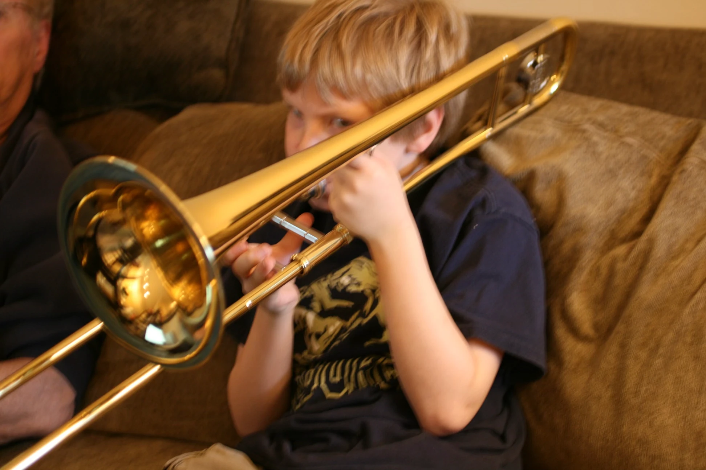

I grew up playing *jazz trombone* throughout middle and high school, eventually
catching the electronic music bug and finding myself working in FL Studio. After
realizing what a mistake of software that is, I moved myself over to Ableton. I
would describe my musical influences as jazzy, noisy, bleepy, and bloopy. I've made
things ranging from soft soothing _lo-fi hip-hop_ to repugnant noisey wall-of-sound.

-------

Currently, I'm fond of odd analog sound machines - instrument creators currently inspiring
me include: *Lorre Mill*, *Ciat Lonbarde*, and the general *4U Modular* scene.

## Where To Listen

> I'm not as active in making and releasing music these days. You'll find most of my music released on the platforms listed below.

Most of my music is accessible (begrudgingly) via [Spotify](https://open.spotify.com/artist/2stp6XCHbjsyVmOYGyYBuz?si=i3yoQQjXTY-YWtr2vZ96Aw).

You can also find me on Apple Music, Tidal, and other major streaming platforms.

A small body of my work is available on [Bandcamp](https://zaneschaffer.bandcamp.com)
