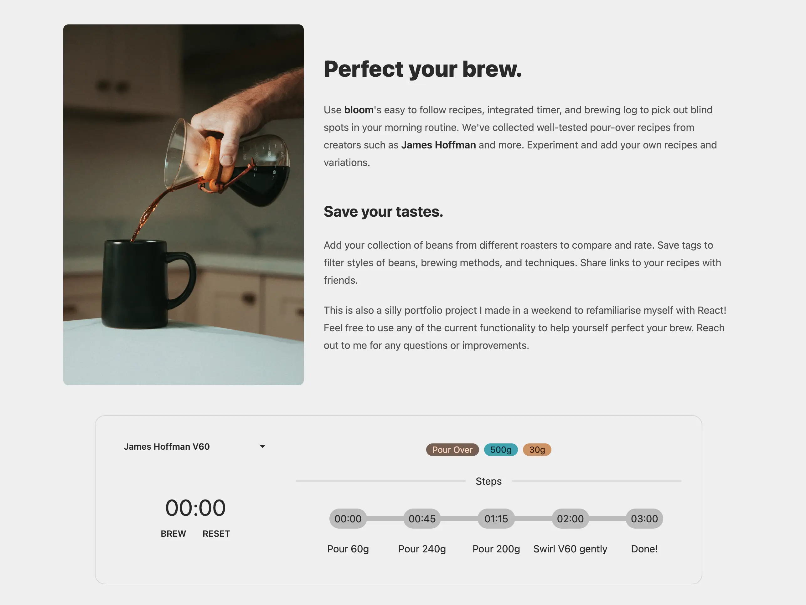
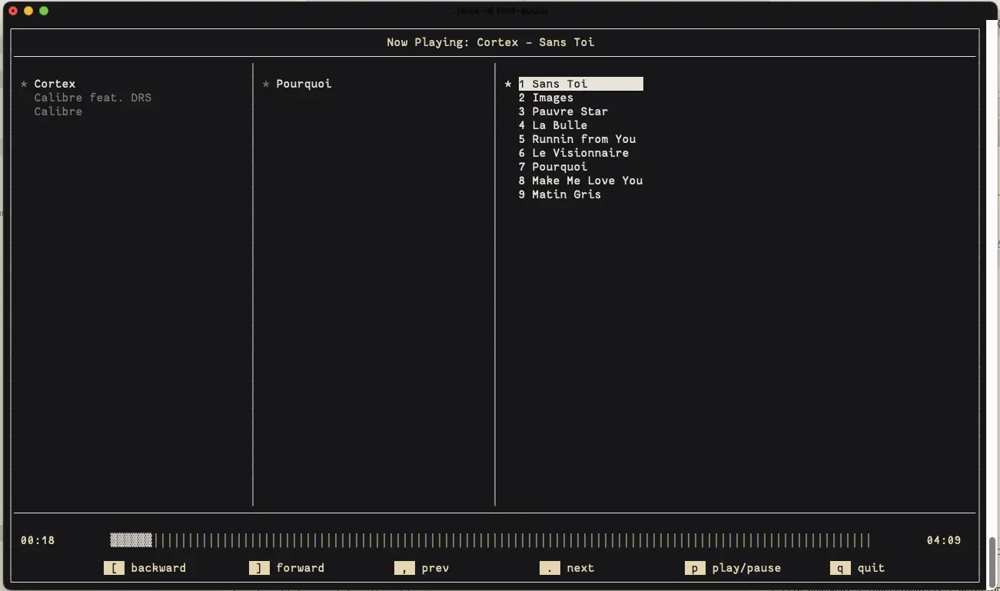
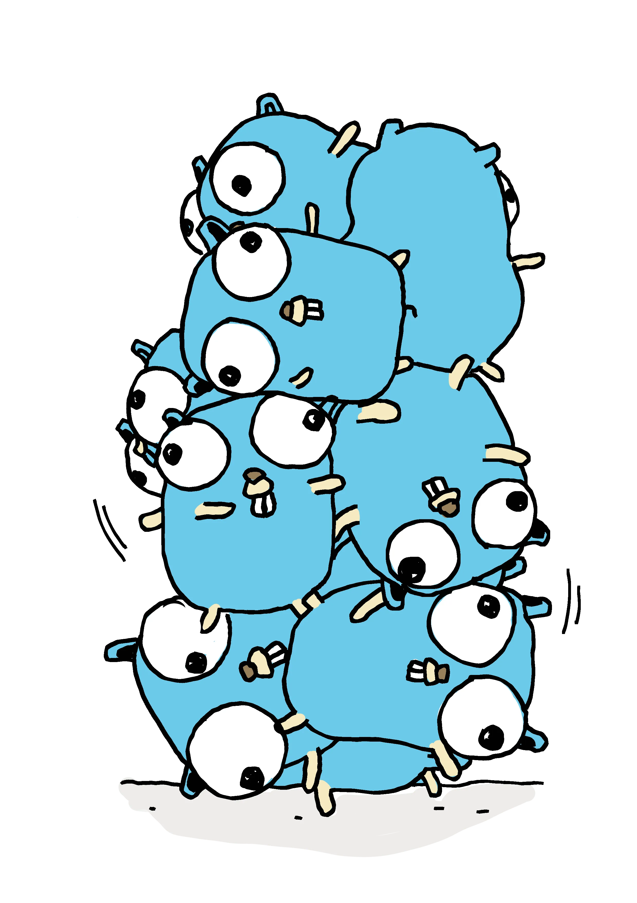

## [Bloom](https://bloom.znschaffer.com)

An interactive coffee brewing timer, brew log, and recipe stash.

## [Wax](https://github.com/znschaffer/wax.git)

A terminal based graphical music player, akin to CMUS. 

Written in C using [TagLib](https://taglib.org) and [ncurses](https://invisible-island.net/ncurses)

## [Jenga](https://github.com/znschaffer/jenga)

Jenga is a no frills, fast-enough static site builder written in Go. It is
optimized for single-page infinite scrolling blogs. Jenga takes a source
directory of markdown files and an HTML template and spits outs a full HTML
blog.

Written in Go 

